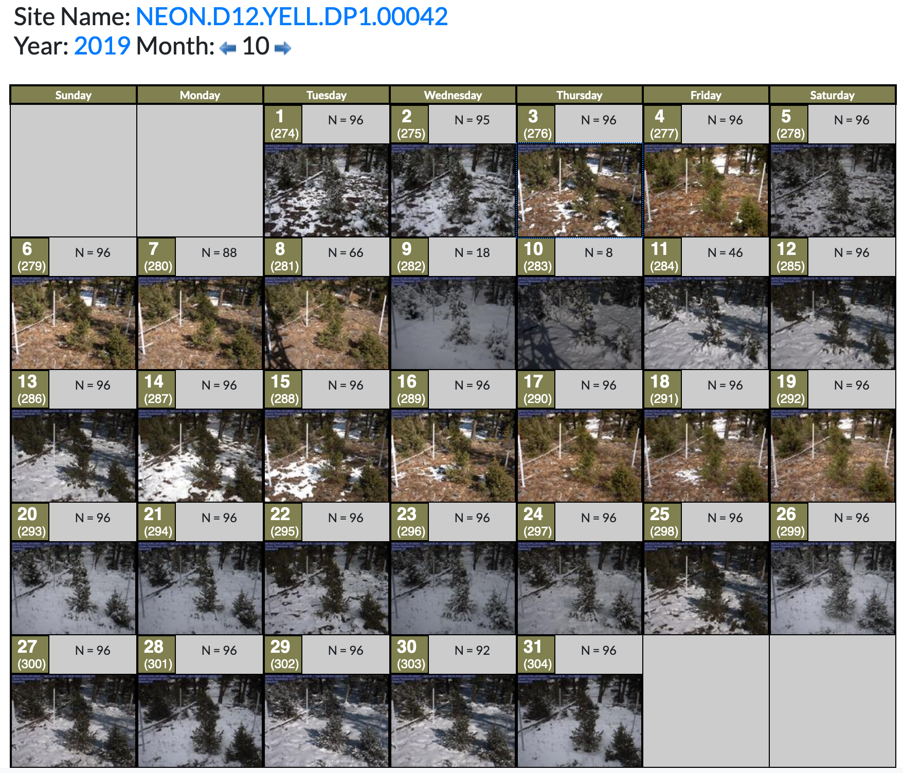
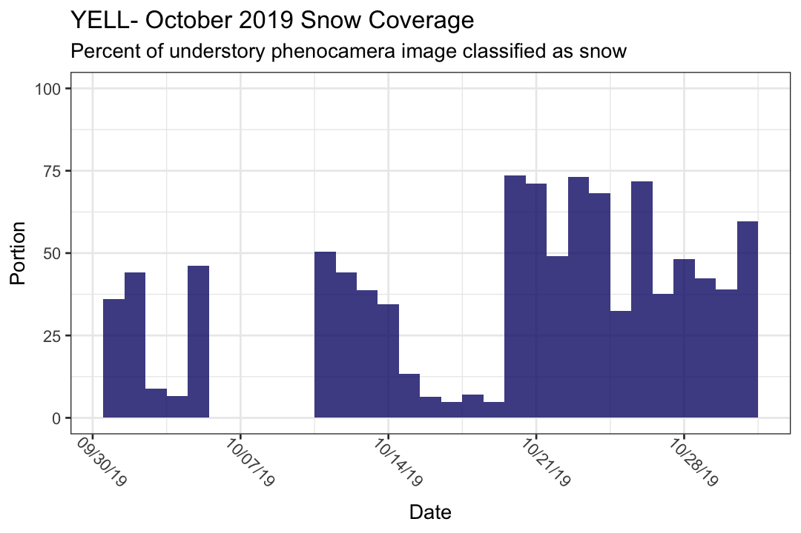

```{r setup, include=FALSE}
library(ytBangerz)
library(magrittr)
#setwd(dir="~/GitHub/drizzle/snow-detection/")
```


Lets look at snowcover for YELL, in October. The understory phenocam images for that month looks interesting, with snowfall and periods of snow coming and going thruout the month:

```{r yellOverview, echo=FALSE, fig.cap="_A screenshot of the YELL understory phenocam images for October 2019_", out.width = '100%'}

```


```{r imageGet}
site = "YELL"

# To speed up vignette production we collate the information and save it as octoberSnow.RDS. 

# If that .RDS doesn't exist, the code below re-creates it.
if(!file.exists("octoberSnow.RDS")){
# Make a sequence of dates that we're interested in, in Oct
# Is this needlessly complicated? Yes. 
october=1:lubridate::days_in_month(10) %>%
  stringr::str_pad(string = ., width = 2, side = "left", pad = "0") %>%
  paste0("2019-10-", .)

# generate a list of phenocam urls
phenoUrls=lapply(october, function(date) ytBangerz::getPhenoUrls(site = site, date = date)) %>%
  unlist %>% 
  na.omit() %>%
  as.character()


# Loop thru our URLs, performing a snow detect on each of them. Unlist the result
snowPortion=lapply(phenoUrls, ytBangerz::detectSnow) %>% 
  unlist()

# we had to drop some urls for not bing noon images. what did we get?
availableDates=stringr::str_extract(string = phenoUrls, pattern = "[0-9]{4}_[0-9]{2}_[0-9]{2}") %>% 
  gsub(pattern = "_", replacement = "-")

# Make a data frame of the data we got, retaining information for noon-time images
octoberSnow=data.frame(
  "Date"=as.Date(availableDates),
                       "Portion"=snowPortion*100
  )

#
saveRDS(octoberSnow, file = "octoberSnow.RDS")
}else{
  octoberSnow=readRDS("octoberSnow.RDS")
}

knitr::kable(octoberSnow)
```

```{r plot, echo=FALSE}
# To speed up plotting, we plot once and save. If the plot ain't there, make it again.

savedImage=paste0(site, " 2019.png")

if(!file.exists(savedImage)){
p=ggplot2::ggplot(data=octoberSnow, ggplot2::aes(x=Date, y=Portion))+
  ggplot2::geom_col(width = 1, alpha=0.8, fill="#0e1675")+
  ggplot2::scale_x_date(date_breaks = "1 week", date_labels = "%D")+
  ggplot2::scale_y_continuous(limits = c(0, 100))+
  ggplot2::ggtitle(label = paste0(site,  "- October 2019 Snow Coverage"), subtitle = "Percent of understory phenocamera image classified as snow")+
  ggplot2::theme_bw()+ggplot2::theme(axis.text.x = ggplot2::element_text(angle=-45, vjust = -.7))

ggplot2::ggsave(filename = savedImage, plot = p, device = "png", width = 6, height = 4, units = "in", dpi = 180)
}
```


```{r yellPlot, echo=FALSE, fig.cap="_Detected snow in the Yellowstone phenocam images from October 2019,_", out.width = '100%'}

```

